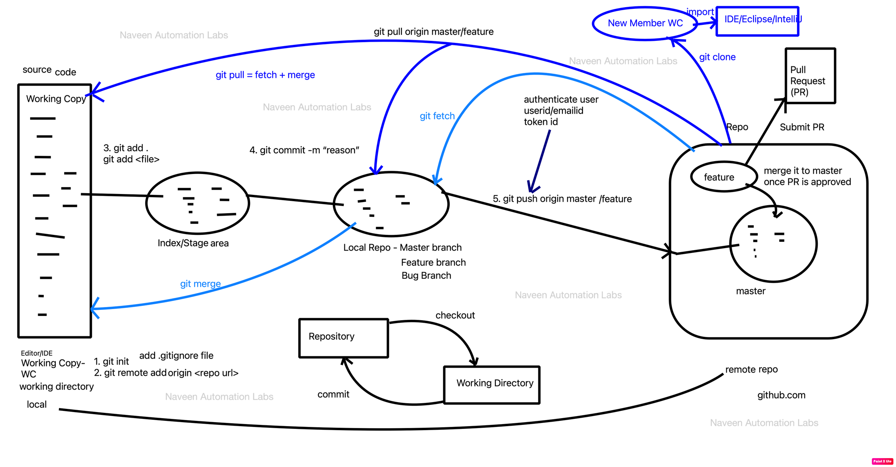

# GIT Architecture & Workflow 

## key components and their relationships:

1. <b>Working Copy (WC):</b> This represents the local development environment where code changes are made.

2. <b>Initialization and Remote Setup: </b> 
      git init -  Initializes a new Git repository and starts tracking an existing directory. 
      add .gitignore file: Used to specify intentionally untracked files that Git should ignore.
      git remote add origin <repo url>: This links the local repository to a remote repository, typically hosted on platforms like GitHub.

3. <b>Index/Stage area:</b> Before a commit, changes are added to this staging area using git add . or git add <file>. It represents a snapshot of the content that will go into the next commit.git commit -m "reason": Commits the staged changes with a message describing the reason or the nature of the changes.

4. <b>Local Repo:Local Repository:</b> Contains all the branches and their respective commits, including the master, feature, and bug branches

5. <b>git merge:</b> Merges changes from one branch to another. It's visually depicted as an arrow merging into the master branch.

6. <b>Pushing to Remote:</b> git push origin master/feature: Pushes the commits made on the local branch to a remote repository. Before this action, one would typically authenticate with a userid/email id or a token id.

7. <b>Fetching and Pulling from Remote:</b>
      git fetch: Downloads new data from a remote repository without merging changes.
      git pull = fetch + merge: Fetches the changes from the remote repository and merges them.The diagram denotes git pull origin master/feature, indicating that the pull is targeting the master or feature branch.

8. <b>Pull Request (PR): </b> Once changes are pushed to a feature branch on the remote repository, one can raise a PR. After review, it gets merged into the master branch.

## Reference
[https://www.atlassian.com/git](https://www.atlassian.com/git)