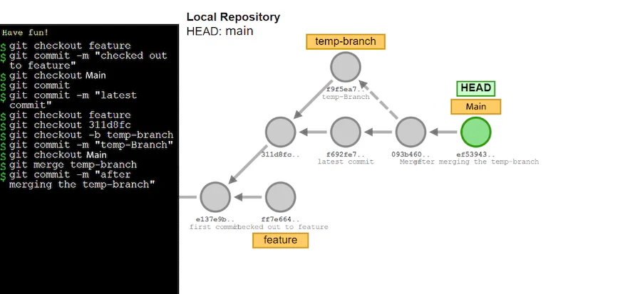

# Git Checkout

The git checkout command lets you navifate between the branches created by git branch commnad 

You may confused git checkout with git clone, clone works to fetch code from a remote repository, while git checkout works to switch between versions of code that already in local.

## checkout an existing branch

```git checkout <branch name>```

## create a new branch and then checkout

```
# create a new branch based on current branch
git branch <branch name> 
git checkout <branch name>
```

or

```git checkout -b <new branch name>```

## Checkout a remote branch

Each remote repository will contains its own set of branches, in oder to checkout a remote branch, you have to firsts fetch the contents of the branch
```
git fetch --all
```
then checkout the branch

```git chechout <remotebranch>```

Old version of git require the creation of new branch absed on the remote

```git checkout -b <remotebranch name> origin/<remotebranch>```

## Detached Head

Head is git's way of referring to the current snapshot, git checkout command simply updates the HEAD to point to ether the specific branch or commit (depends on you checkout a branch or a commit), when point to a branch, it is OK, the HEAD will point to the latest commit of the branch. But when you checkout a commit, HEAD will point to the commit, and it is in a "detached HEAD" state. If you were to start developing a feature in a detached HEAD state, there would be no branch allowing you to get back to it


### Scenariors that can cause a detached HEAD state

You can find yourself in a detached HEAD state primarily through two scenarios:

* Checking out a specific Secure Hash Algorithm 1 (SHA-1) commit hash
* Checking out to a remote branch without fetching it first
We already demonstrated that if you check out the SHA-1 commit hash, you will be in the detached HEAD state. Another situation that causes a detached HEAD is checking out the remote branch. If you check out to the origin (main) branch, which is read-only, you will be in the detached HEAD state.

Some other scenarios can cause a detached HEAD as well. For example, checking out to a specific tag name or adding ^0 on any given branch causes the detached HEAD state.

### How to save changes in a detached HEAD
1. Create a new branch


2. Commit the changes


3. Merge the changes
Now, you check out to the branch where you want the changes. In this case, you want to merge the changes to the main branch. So, you first need to check out the main branch, then merge the changes from temp-branch and add the final commit message.


## How to discard changes in a detached HEAD
If you want to discard the changes in the detached HEAD state, you only need to check out to the existing or previous branch. The commits on the detached HEAD state will not affect your existing branch, and Git will archive them.